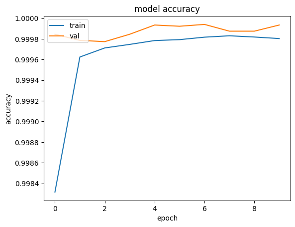
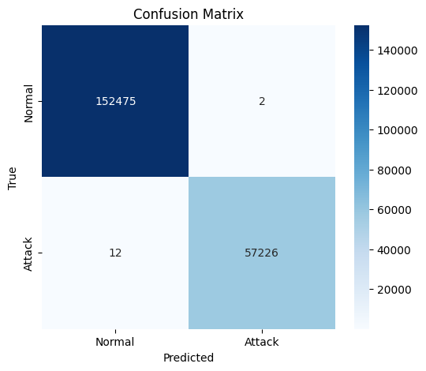

## Cyber Security of Software Systems 

**Course project:** *Intrusion Detection System*<br/>**Group:** *LPR*<br/>**Programming language(s):** *Python (Part I compatible with Google Colab, Part II tested with 3.12)*<br/>
**Third party libraries:**<br/> 
- Part I: [Colab Notebook](./colab_train_detector.ipynb) has extensive list of required libraries, but there's no need to install anything locally.
- Part II: [cd.py](./cd.py):
    - tensorflow 2.18.0
    - pandas 2.2.3
    - numpy 2.0.2
    - scikit-learn 1.6.1
    - joblib 1.4.2


### Introduction

In this project, we explore the application of machine learning techniques—specifically a neural network—for detecting malicious activity in network traffic. The goal is to demonstrate how supervised learning can be used to distinguish between normal and intrusive behavior using flow-level network features.

To build and evaluate the model, we used a subset of the CSE-CIC-IDS2018 dataset [\[1\]](#ref1), a comprehensive and realistic dataset created by the Canadian Institute for Cybersecurity (CIC) in collaboration with the Communications Security Establishment (CSE). The dataset was generated in a controlled testbed at the University of New Brunswick, simulating an enterprise network environment with:
- 420 machines representing employees across five departments
- 30 servers offering services like web, email, FTP, and DNS
- An attacker infrastructure with 50 machines generating malicious traffic

The data includes both benign and malicious network activity, covering a wide range of attack types, including:
- Brute-force attacks (SSH, FTP)
- Botnet activity
- Denial-of-Service (DoS) and Distributed DoS (DDoS)
- Web-based attacks (e.g., XSS, SQL Injection)
- Heartbleed exploit
- Internal network infiltration

The captured network traffic data was converted to 80 flow-level features with *CICFlowMeter-V3*, a tool that computes statistics such as packet size, duration, flow direction, and protocol behavior. Each flow is labeled as benign or as a specific attack type, making the dataset ideal for both binary and multi-class classification. 

While the full dataset is approximately 7 GB, for this project we focused on a manageable subset to demonstrate how an intrusion detection system (IDS) might work in practice using machine learning. We acknowledge that the more extensive dataset, and the more time spent on training would likely produce better results. We also use only the binary classification to benign and attack instead of the full classification.

We have split this project into two parts. 

[Part I](#part-i-training-a-neural-network) covers everything about training a machine learning model which in this case is a neural network on CSE-CIC-IDS2018 dataset in Google Colab. 

[Part II](#part-ii-command-line-interface-cli-tool) makes use of the model obtained from the first part presenting a command line interface (CLI) tool that can be used for detecting possible intrusions by assigning labels to incoming packets. The CLI tool is unfortunately *Windows* operating system exclusive at this point since both Wireshark and CICFlowMeter, the tool that is used to convert packets into useful features, use Windows.  

### Part I. Training a neural network

The code for training a neural network for the purpose of intrusion detection in Google Colab see [notebook](./colab_train_detector.ipynb). Execution time for the notebook varies but is approximately 15-30 minutes with CPU. GPU based execution time has not been verified. 

The classification accuracy on test data is very impressive ~99.9%. The accuracy in terms of epochs and confusion matrix with respect to the test data are as follows (note: due to randomness the results may vary with your execution):
| Accuracy vs epoch | Confusion matrix |
|--|--|
|  |  |

Outputs extracted from the created Google drive folder include the neural network model file for [Keras](https://keras.io/), feature standardizer for [scikit-learn](https://scikit-learn.org) and test data can be found at [CIC_IDS2018](./CIC_IDS2018/). 

Two formats are offered for Keras model ```.h5``` and ```.keras```, however the latter is used in the codes. The ```.pkl``` file is used for the feature standardizer and ```Xy_test.zip``` houses the test data (20% of the full data).

### Part II. Command Line Interface (CLI) tool
The Python file ```cd.py``` contains the command like interface runnable tool that can be used for capturing and categorizing traffic (i.e intrusion detection) as well as categorizing individual packet data and flow files. 

Before operation setting paths for ```dumpcap.exe``` from [Wireshark](https://www.wireshark.org/) and working directory of ```cfm.bat``` from [CICFlowMeter-V4](https://www.researchgate.net/publication/326991554_CICFlowmeter-V40_formerly_known_as_ISCXFlowMeter_is_a_network_traffic_Bi-flow_generator_and_analyser_for_anomaly_detection_httpsgithubcomISCXCICFlowMeter) as well as paths to model file obtained from Part I ```.keras``` and scaler ```.pkl``` are required on top of ```cd.py```. 

Noe that interface id is required for the ```--interface``` flag as this determines the source (i.e WLAN). One way of finding out is to make use of the Wireshark installation and run
```
dumpcap.exe -D
```
on its installation directory.

**Example 1**: *View available options*

```cmd
py -3.12 -m cd --help

usage: cd.py [-h] [--interval INTERVAL] [--interface INTERFACE] [--log LOG] [--output-dir OUTPUT_DIR]
             [--duration DURATION] [--dry-run] [--test-input TEST_INPUT]

Network Intrusion Detection CLI Tool

options:
  -h, --help            show this help message and exit
  --interval INTERVAL   Capture interval in seconds
  --interface INTERFACE
                        Network interface ID (from dumpcap.exe -D)
  --log LOG             Path to the output log file
  --output-dir OUTPUT_DIR
                        Directory to save temporary files
  --duration DURATION   How long to run (e.g., 30s, 5m, 2h, 1d)
  --dry-run             Validate config and dependencies without running the main loop
  --test-input TEST_INPUT
                        Path to a pre-converted flow CSV or pcap file (test phase only)
```

**Example 2**: *Test everything works (paths set, tools installed etc.)*
```
py -3.12 -m cd --dry-run
```
Should there be a problem with any of the paths at ```cd.py``` then erros are produded.

**Example 3**: *Capture traffic at 5 second intervals for 60 seconds*:
```
py -3.12 -m cd --duration 60s --interval 5 --interface [INTERFACE] --output-dir "./"
```
The time that it took between intervals as well as the id, timestamp and label should be shown on screen. Also, a logfile is generated with timestamp in milliseconds.

In addition to capturing a testbed of sorts is also included. The flag ```--test-input``` followed by a flow file extension with ```.csv``` e.g ```X_test.csv``` (from the [test file](./CIC_IDS2018/Xy_test.zip)) results in a lengthy output of some ~200k lines. Should the test file have ```.pcap``` extension it is first converted to a flow file and then predict is run.

**Example 4**: *predict labels for X_test.csv flow file from the CIC_IDS2018 dataset*:
```
py -3.12 -m cd --test-input "[path to]/X_test.csv"
```
The labels displayed should vary from attack to benign. Timestamp only shows current time and not the time when the data was recorded.

### Conclusion
By combining machine learning with realistic flow-level network traffic, this project delivers a full pipeline—from training to real-world inference—for a basic IDS. The neural network achieves high accuracy on test data, and the CLI tool offers a practical interface for deploying the model on live or recorded traffic.

Future work could extend this system with:
- Multi-class classification to detect specific attack types
- Use of more days/files from the full dataset for generalization
- Integration with real-time dashboards or alerting systems

### References 
<a name="ref1">[1]</a>: https://www.unb.ca/cic/datasets/ids-2018.html<br/>