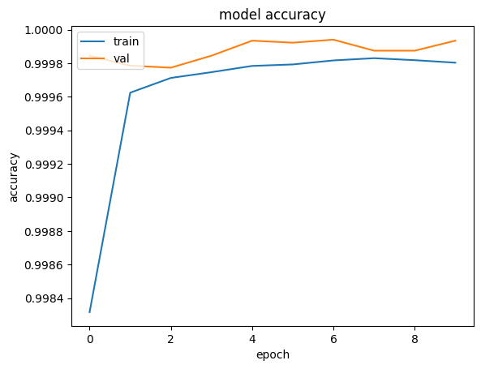
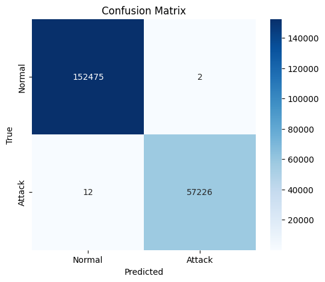

## Cyber Security of Software Systems

### Course project description<br/>
*TBA*

### Neural network training for intrusion detection
The code for training a neural network for the purpose of intrusion detection in Colab see [notebook](./ccsoss_v1.ipynb). This model only detects binary labels.

Note that we've only used a small proportion of the CIC-IDS 2018 [\[1\]](#ref1) dataset, namely 
```Friday-02-03-2018_TrafficForML_CICFlowMeter.csv``` for training the model in order to demonstrate how such intrusion detector might work. The whole dataset is about ~7Gb and requires hours of training time even with Colab.

In short, the model training terminates early before the assigned 25 epochs as validation loss no longer improves. The classification accuracy on test data is very impressive ~99.9%. The confusion matrix is as follows:
| Accuracy vs epoch | Confusion matrix |
|--|--|
|  |  |

Outputs extracted including the neural network model file for [Keras](https://keras.io/), feature standardizer for [scikit-learn](https://scikit-learn.org) and test data can be found at [CIC_IDS2018](./CIC_IDS2018/). 

Two formats are offered for Keras model ```.h5``` and ```.keras```, however the latter is used in the codes. The ```.pkl``` file is used for the feature standardizer and ```Xy_test.zip``` houses the test data (20% of the full data).


### CLI tool
The tool ```cd_v1.py``` can be used for demostrating how network traffic is captured and categorized as well as testing individual packet data files and flow files for categorization. 

Before operation setting paths to ```dumpcap.exe``` from [Wireshark](https://www.wireshark.org/) and location of ```cfm.bat``` from [CICFlowMeter](https://www.researchgate.net/publication/326991554_CICFlowmeter-V40_formerly_known_as_ISCXFlowMeter_is_a_network_traffic_Bi-flow_generator_and_analyser_for_anomaly_detection_httpsgithubcomISCXCICFlowMeter) is required. 

One may also need to find out the interface id for the mandatory ```--interface``` flag. One way of finding out is to run 
```
dumpcap.exe -D
```

Example 1: *Test everything works (paths set, tools installed etc.)*
```
py -3.12 -m cd_v1 --dry-run
```


Example 2: *Capture traffic at 5 second intervals for 60 seconds*:
```
py -3.12 -m cd_v1 --duration 60s --interval 5 --interface [INTERFACE] --output-dir "./"
```

In addition to capturing a testbed of sorts is also included. The flag ```--test-input``` followed by a flow file extension with ```.csv``` e.g ```X_test.csv``` (from the [test file](./CIC_IDS2018/Xy_test.zip)) results in a lengthy output of some ~200k lines. Should the test file have ```.pcap``` extension it is first converted to a flow file and then predict is run.

Example 3: *predict labels for X_test.csv flow file from the CIC_IDS2018 dataset*:
```
py -3.12 -m cd_v1 --test-input "[path to]/X_test.csv"
```

### References 
<a name="ref1">[1]</a>: https://www.unb.ca/cic/datasets/ids-2018.html<br/>